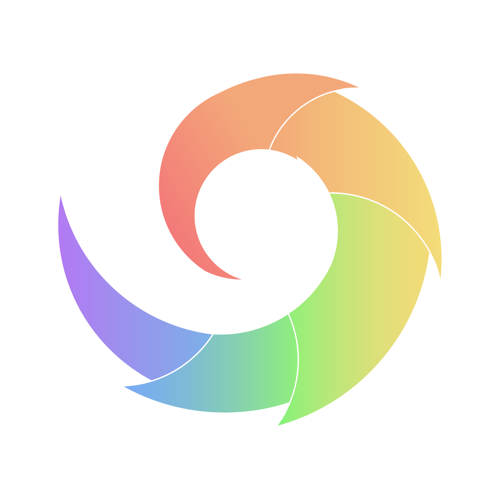

 

## Table of contents
- [About](#about)
- [Contributing](#contributing)
- [Status](#status)

## About
Discordoo is a powerful, modular Discord-library.

We have now:
- Powerful types
- Modular

And we plan:
- Powerful cache management
- Fully customizable sharding
- Modules optimized for high load
- Modules from third-party developers

## Status
Discord API Coverage: 0%

## Contributing
Feel free to create a PR, but check if there is an existing one.
See [Contributing Guide](https://github.com/Discordoo/discordoo/blob/master/CONTRIBUTING.md).
